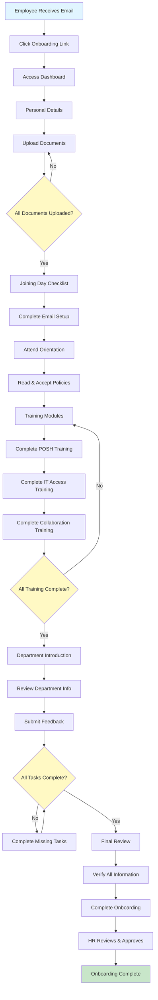
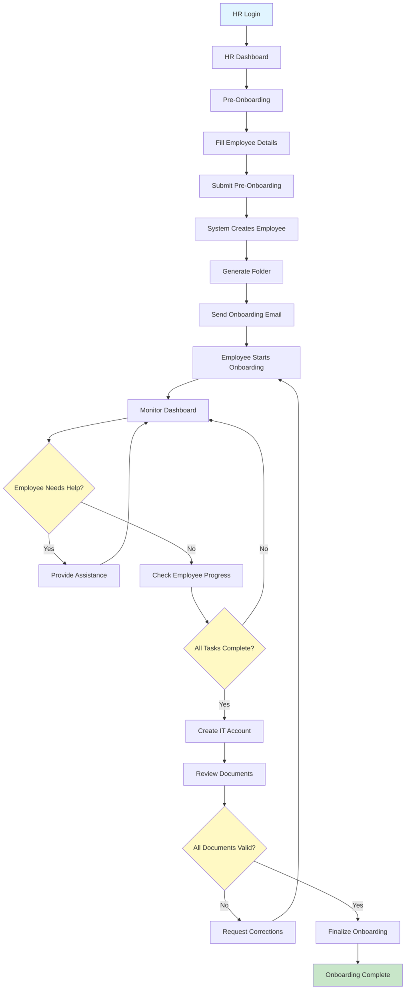
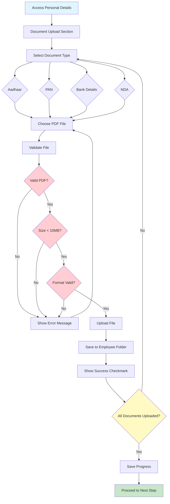
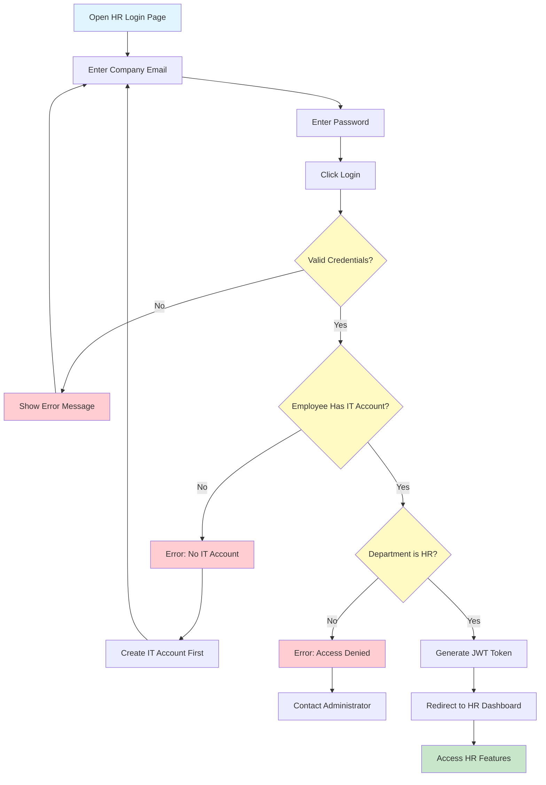
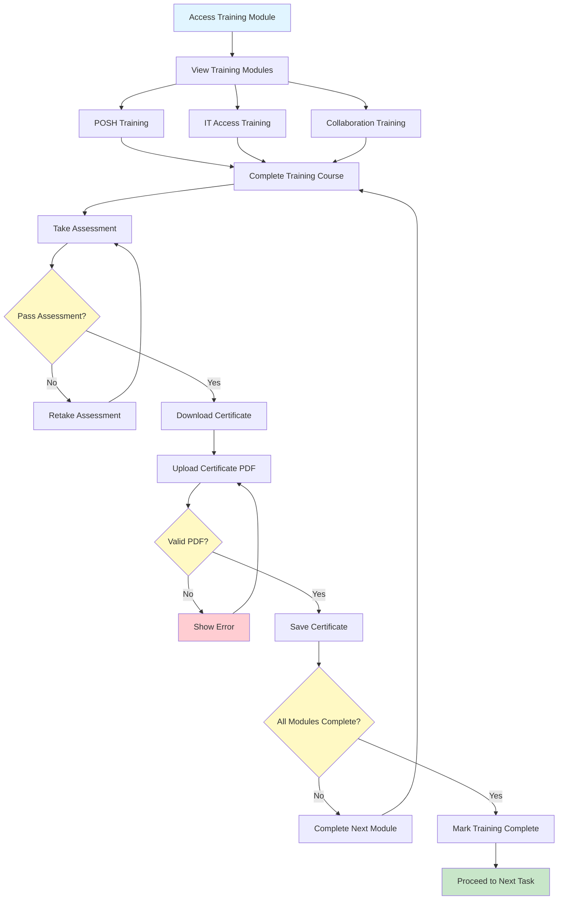
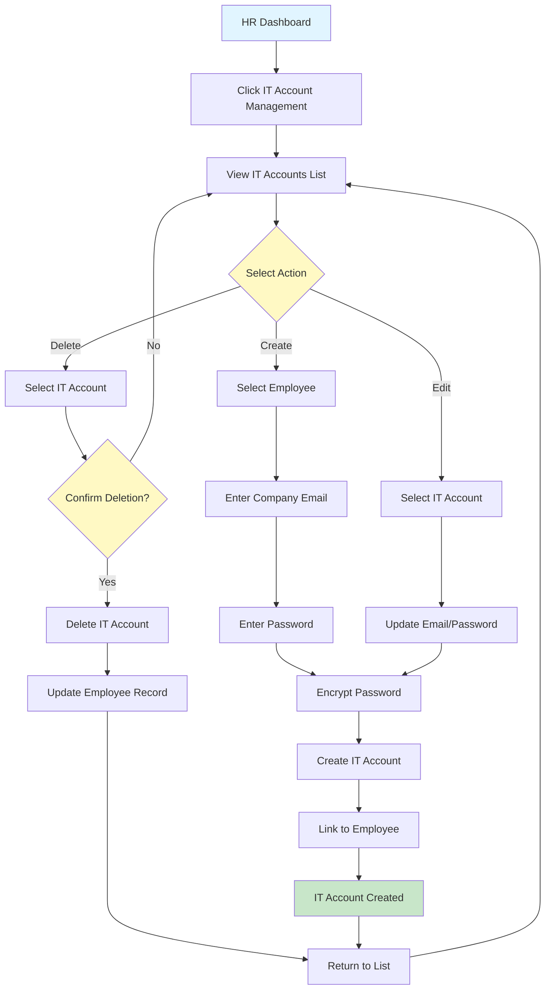
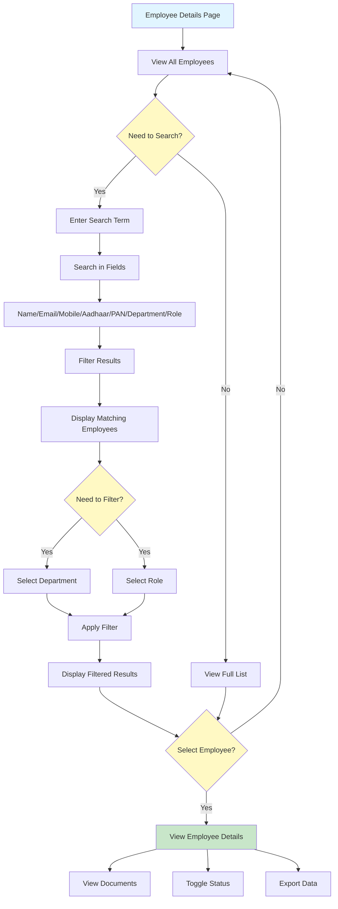

# AI HR Onboarding System - User Manual

## Table of Contents

1. [Introduction](#introduction)
2. [Getting Started](#getting-started)
3. [Visual Flowcharts](#visual-flowcharts)
4. [HR User Manual](#hr-user-manual)
5. [New Employee User Manual](#new-employee-user-manual)
6. [FAQs](#faqs)
7. [Troubleshooting](#troubleshooting)

---

## Visual Flowcharts

> **Note**: These flowcharts use Mermaid syntax. They can be rendered in:
> - GitHub/GitLab markdown viewers
> - Many markdown editors (Typora, Mark Text, etc.)
> - Online tools (mermaid.live)
> - Word documents (convert using online tools or plugins)

### Complete Onboarding Workflow (Employee)



### HR Workflow - Complete Employee Onboarding Process



### Document Upload Process



### HR Login and Authentication



### Training Module Completion



### IT Account Management (HR)



### Employee Search and Filter (HR)



---

## Introduction

### About This System

The AI HR Onboarding System is an intelligent platform designed to streamline and automate the employee onboarding process. It provides:

- **Automated Workflows**: Complete onboarding process from pre-onboarding to joining day
- **AI Chatbot (SUPA)**: Instant answers to your questions
- **Document Management**: Secure PDF upload and validation
- **Progress Tracking**: Real-time tracking of onboarding progress
- **HR Analytics**: Comprehensive analytics and employee management

### System Access

- **HR Portal**: Access via HR login page
- **Employee Portal**: Access via unique link sent in onboarding email
- **AI Chatbot**: Available on both portals for instant assistance

---

## Getting Started

### System Requirements

- **Web Browser**: Chrome, Firefox, Safari, or Edge (latest versions)
- **Internet Connection**: Stable internet connection required
- **PDF Viewer**: For viewing and downloading documents
- **Email Access**: For receiving onboarding links and notifications

### First Time Access

1. **For HR Users**: Contact system administrator for login credentials
2. **For New Employees**: Check your email for onboarding invitation link

---

## HR User Manual

### Section 1: HR Login

#### Step 1.1: Access HR Login Page

1. Open your web browser
2. Navigate to the HR login page
3. You will see the login form

#### Step 1.2: Login Process

1. **Enter Company Email**: Use your company email address (the one associated with your IT account)
2. **Enter Password**: Enter your IT account password
3. **Click "Login"** button
4. If credentials are correct, you will be redirected to the HR Dashboard

**Note**: Only employees with department set to "HR" can access the HR portal.

#### Flowchart: HR Login Process

```
┌─────────────────┐
│  Open Browser   │
└────────┬────────┘
         │
         ▼
┌─────────────────┐
│ Navigate to HR │
│  Login Page    │
└────────┬────────┘
         │
         ▼
┌─────────────────┐      ┌──────────────┐
│ Enter Email &  │──No──│ Show Error  │
│   Password     │      │   Message   │
└────────┬───────┘      └──────────────┘
         │ Yes
         ▼
┌─────────────────┐
│  Check HR       │
│  Department     │
└────────┬────────┘
         │
         ▼
┌─────────────────┐
│ HR Dashboard   │
└─────────────────┘
```

---

### Section 2: Pre-Onboarding (Creating New Employee)

#### Step 2.1: Navigate to Pre-Onboarding

1. From HR Dashboard, click on **"Pre-Onboarding"** button or navigate to Pre-Onboarding page
2. You will see the Pre-Onboarding form

#### Step 2.2: Fill Employee Details

1. **Employee ID**: Enter unique employee ID (e.g., SDS00001)
   - Format: Letters and numbers
   - System will automatically convert to uppercase
   
2. **Full Name**: Enter employee's full name
   - Example: "John Doe"
   
3. **Email**: Enter employee's personal email address
   - This email will receive the onboarding invitation
   
4. **Department**: Select department from dropdown
   - Options: HR, Admin, Testing, Design, Development
   
5. **Role**: Select role based on selected department
   - Roles vary by department
   - Example: For Development - Frontend Developer, Backend Developer, etc.

#### Step 2.3: Submit Pre-Onboarding

1. Review all entered information
2. Click **"Submit"** button
3. System will:
   - Create employee record
   - Generate unique folder for documents
   - Send onboarding email to employee
   - Display success message

#### Flowchart: Pre-Onboarding Process

```
┌─────────────────┐
│  HR Dashboard   │
└────────┬────────┘
         │
         ▼
┌─────────────────┐
│ Click Pre-      │
│ Onboarding      │
└────────┬────────┘
         │
         ▼
┌─────────────────┐
│ Fill Employee   │
│   Details       │
│ - Employee ID   │
│ - Full Name     │
│ - Email         │
│ - Department    │
│ - Role          │
└────────┬────────┘
         │
         ▼
┌─────────────────┐      ┌──────────────┐
│ Validate &      │──No──│ Show Error  │
│ Check Duplicate │      │   Message   │
└────────┬───────┘      └──────────────┘
         │ Yes
         ▼
┌─────────────────┐
│ Create Employee │
│   Record        │
└────────┬────────┘
         │
         ▼
┌─────────────────┐
│ Generate Folder │
│   for Documents │
└────────┬────────┘
         │
         ▼
┌─────────────────┐
│ Send Onboarding │
│   Email         │
└────────┬────────┘
         │
         ▼
┌─────────────────┐
│ Show Success    │
│   Message       │
└─────────────────┘
```

---

### Section 3: HR Dashboard Overview

#### Step 3.1: Dashboard Components

The HR Dashboard provides:

1. **Statistics Cards**:
   - Total Employees
   - Active Employees
   - Pending Onboarding
   - Completed Onboarding

2. **Charts and Analytics**:
   - Department-wise employee distribution (Pie Chart)
   - Onboarding status breakdown (Bar Chart)
   - Recent joinees list
   - Feedback statistics

3. **Quick Actions**:
   - Pre-Onboarding button
   - Employee Details button
   - IT Account Management
   - Email Account Management

#### Step 3.2: View Analytics

1. **Department Distribution**: View pie chart showing employee distribution across departments
2. **Onboarding Status**: View bar chart showing pending, in-progress, and completed onboarding
3. **Recent Joinees**: See list of recently added employees
4. **Feedback Stats**: View average feedback rating and total feedback count

#### Step 3.3: Export Employee Data

1. Click **"Export to Excel"** button
2. System generates Excel file with all employee data
3. File automatically downloads
4. Open Excel file to view comprehensive employee information

---

### Section 4: Employee Management

#### Step 4.1: Access Employee Details

1. From HR Dashboard, click **"Employee Details"** button
2. You will see the Employee Details page with all employees

#### Step 4.2: Search and Filter Employees

**Search Functionality:**
1. Use the search bar at the top
2. Search by:
   - Employee Name
   - Email
   - Company Email
   - Mobile Number
   - Aadhaar Number
   - PAN Number
   - Department
   - Role
3. Results update in real-time as you type

**Filter Functionality:**
1. Use **Department** dropdown to filter by department
2. Use **Role** dropdown to filter by role
3. System automatically normalizes department names (e.g., "HR" matches "hr", "Hr")
4. Click **"Clear Filters"** to reset

#### Step 4.3: View Employee Information

The Employee Details table shows:
- Employee ID (sticky column - stays visible)
- Employee Name (sticky column - stays visible)
- Email
- Company Email
- Mobile
- Department
- Role
- Status (Active/Disabled)
- Actions (View Details, Status Toggle)

#### Step 4.4: Manage Employee Status

**Enable/Disable Employee:**
1. Find employee in the list
2. Toggle the **Status** switch
3. **Active**: Employee can access the system
4. **Disabled**: Employee cannot access the system
5. Status updates immediately

#### Step 4.5: View Employee Documents

1. Click **"View Details"** button for any employee
2. You will see comprehensive employee information including:
   - Personal Information
   - Family Details
   - Documents Section
3. **Documents Available:**
   - Aadhaar Card
   - PAN Card
   - Bank Details
   - NDA Form
4. **Document Actions:**
   - **View**: Open document in browser
   - **Download**: Download document to your computer
   - **Print**: Print document directly

#### Flowchart: Employee Management Process

```
┌─────────────────┐
│  HR Dashboard   │
└────────┬────────┘
         │
         ▼
┌─────────────────┐
│ Click Employee │
│    Details     │
└────────┬────────┘
         │
         ▼
┌─────────────────┐
│ View Employee   │
│     List        │
└────────┬────────┘
         │
         ▼
┌─────────────────┐
│  Search/Filter  │
│   Employees     │
└────────┬────────┘
         │
         ▼
┌─────────────────┐
│ Select Employee │
└────────┬────────┘
         │
    ┌────┴────┐
    │         │
    ▼         ▼
┌─────────┐ ┌──────────────┐
│ View    │ │ Toggle Status│
│ Details │ │ Enable/Disable│
└────┬────┘ └──────────────┘
     │
     ▼
┌─────────────────┐
│ View Documents  │
│ View/Download/  │
│     Print       │
└─────────────────┘
```

---

### Section 5: IT Account Management

#### Step 5.1: Access IT Account Management

1. From HR Dashboard, click **"IT Account Management"** button
2. Navigate to IT Account Management page

#### Step 5.2: Create IT Account

1. **Select Employee**: Choose employee from dropdown (employees without IT accounts)
2. **Company Email**: Enter company email address
   - Format: username@company.com
3. **Password**: Enter password for the IT account
   - Password will be encrypted and stored securely
4. **Click "Create Account"**
5. System creates IT account and links it to employee

#### Step 5.3: View IT Accounts

The IT Account Management page shows:
- Employee Name
- Company Email
- Creation Date
- Actions (Edit, Delete)

#### Step 5.4: Edit IT Account

1. Find the IT account in the list
2. Click **"Edit"** button
3. Update email or password
4. Click **"Save"** button

#### Step 5.5: Delete IT Account

1. Find the IT account in the list
2. Click **"Delete"** button
3. Confirm deletion
4. IT account is removed (employee can still access system with their token)

#### Flowchart: IT Account Management

```
┌─────────────────┐
│  HR Dashboard   │
└────────┬────────┘
         │
         ▼
┌─────────────────┐
│ Click IT Account│
│   Management    │
└────────┬────────┘
         │
         ▼
┌─────────────────┐
│ Select Action   │
└────────┬────────┘
         │
    ┌────┴────┐
    │         │         │
    ▼         ▼         ▼
┌─────────┐ ┌──────┐ ┌──────┐
│ Create  │ │ Edit │ │Delete│
│ Account │ │      │ │      │
└────┬────┘ └──┬───┘ └──┬───┘
     │         │        │
     ▼         ▼        ▼
┌─────────────────┐
│ Enter Details   │
│ - Employee      │
│ - Email         │
│ - Password      │
└────────┬────────┘
         │
         ▼
┌─────────────────┐
│ Encrypt & Save  │
└─────────────────┘
```

---

### Section 6: Email Account Management

#### Step 6.1: Access Email Account Management

1. From HR Dashboard, find **"Email Account Setup"** section
2. Click **"Manage Email Accounts"** or access from settings

#### Step 6.2: Add Email Account

1. **Email Address**: Enter email address
2. **Password**: Enter email password
3. **Display Name**: Enter display name (e.g., "HR Team")
4. **Notes**: Optional notes about the account
5. Click **"Add Email Account"**
6. System validates and saves email account

#### Step 6.3: Set Default Email Account

1. View list of email accounts
2. Find the account you want to set as default
3. Click **"Set as Default"** button
4. This email will be used for sending onboarding emails

#### Step 6.4: Delete Email Account

1. Find email account in the list
2. Click **"Delete"** button
3. Confirm deletion
4. Account is removed (cannot delete default account - set another as default first)

---

### Section 7: Password Reset

#### Step 7.1: Access Password Reset

1. From HR Dashboard, click on your profile or settings
2. Click **"Reset Password"** option

#### Step 7.2: Reset Password

1. **Current Password**: Enter your current password
2. **New Password**: Enter new password
3. **Confirm Password**: Re-enter new password
4. Click **"Reset Password"** button
5. System validates and updates password
6. You will need to login again with new password

---

### Section 8: Using the AI Chatbot (SUPA)

#### Step 8.1: Access Chatbot

1. The chatbot is available on the HR Dashboard
2. Look for the **"SUPA Chat"** button or chat icon
3. Click to open chat window

#### Step 8.2: Ask Questions

1. Type your question in the chat input field
2. Press **Enter** or click **Send** button
3. SUPA will provide context-aware answers

**Example Questions for HR:**
- "How many employees are in the Development department?"
- "What is the onboarding status of employee SDS00001?"
- "Show me employees with pending documents"
- "What is the average feedback rating?"

#### Step 8.3: Chatbot Features

- **Context Awareness**: Understands employee data and onboarding status
- **Policy Queries**: Answers questions about company policies
- **Analytics**: Provides HR analytics and statistics
- **Real-time Data**: Accesses current employee and onboarding data

---

## New Employee User Manual

### Section 1: Receiving Onboarding Invitation

#### Step 1.1: Check Your Email

1. After HR creates your profile, you will receive an email
2. Subject: "Welcome to [Company Name] - Start Your Onboarding"
3. Email contains:
   - Welcome message
   - Onboarding link (unique to you)
   - NDA form attachment (PDF)

#### Step 1.2: Access Onboarding Link

1. Click the **onboarding link** in the email
2. Link format: `http://your-domain/onboarding/YOUR_TOKEN`
3. Link opens in your web browser
4. You will see your personalized onboarding dashboard

**Note**: Save this link - you can use it to access your dashboard anytime

#### Flowchart: Initial Access

```
┌─────────────────┐
│ Receive Email   │
│  from HR        │
└────────┬────────┘
         │
         ▼
┌─────────────────┐
│ Click Onboarding│
│     Link        │
└────────┬────────┘
         │
         ▼
┌─────────────────┐
│ Browser Opens   │
│  Dashboard      │
└────────┬────────┘
         │
         ▼
┌─────────────────┐
│ View Onboarding │
│   Dashboard     │
│  with Tasks     │
└─────────────────┘
```

---

### Section 2: Understanding Your Dashboard

#### Step 2.1: Dashboard Overview

Your dashboard shows:

1. **Welcome Section**: Your name and employee ID
2. **Progress Indicator**: 
   - Overall completion percentage
   - Circular progress indicator
3. **Task Cards**: Six main onboarding tasks:
   - 👤 Personal Details
   - 🎉 Joining Day
   - 📚 Training
   - 🏢 Department Introduction
   - 💬 Feedback
   - 📋 Final Review

#### Step 2.2: Task Status

Each task shows:
- **Pending**: Not started (gray)
- **In Progress**: Started but not completed (yellow)
- **Completed**: Finished (green checkmark)

#### Step 2.3: Navigation

- Click any task card to start or continue that task
- Tasks can be completed in any order (except Final Review)
- Final Review is only available after completing all other tasks

---

### Section 3: Personal Details

#### Step 3.1: Access Personal Details

1. From Dashboard, click **"👤 Personal Details"** card
2. You will see the Personal Details form

#### Step 3.2: Fill Personal Information

**Basic Information:**
1. **Name**: Your full name (pre-filled)
2. **Date of Birth**: Select from date picker (DD/MM/YYYY)
3. **Gender**: Select from dropdown (Male, Female, Other)
4. **Mobile Number**: Enter 10-digit mobile number
5. **Email**: Your email (pre-filled)

**Family Details:**
1. **Family Member 1**:
   - Name
   - Relation (e.g., Father, Mother, Spouse)
   - Mobile Number
2. **Family Member 2** (Optional):
   - Name
   - Relation
   - Mobile Number

**Document Information:**
1. **Aadhaar Number**: Enter 12-digit Aadhaar number
2. **PAN Number**: Enter PAN in format XXXXX1234X
3. **Bank Account Number**: Enter bank account number
4. **IFSC Code**: Enter bank IFSC code

#### Step 3.3: Save Personal Details

1. Review all entered information
2. Click **"Save"** button
3. System validates and saves data
4. Success message appears
5. Click **"Next"** to proceed to document upload

#### Flowchart: Personal Details Process

```
┌─────────────────┐
│   Dashboard     │
└────────┬────────┘
         │
         ▼
┌─────────────────┐
│ Click Personal  │
│    Details      │
└────────┬────────┘
         │
         ▼
┌─────────────────┐
│ Fill Form       │
│ - Basic Info    │
│ - Family Info   │
│ - Document Info │
└────────┬────────┘
         │
         ▼
┌─────────────────┐      ┌──────────────┐
│ Validate Data   │──No──│ Show Error   │
│                 │      │   Message    │
└────────┬───────┘      └──────────────┘
         │ Yes
         ▼
┌─────────────────┐
│ Save Data       │
└────────┬────────┘
         │
         ▼
┌─────────────────┐
│  Proceed to     │
│ Document Upload │
└─────────────────┘
```

---

### Section 4: Document Upload

#### Step 4.1: Access Document Upload

1. After saving Personal Details, you will see document upload section
2. Or navigate from Dashboard → Personal Details → Documents section

#### Step 4.2: Upload Documents

**Required Documents (PDF only):**

1. **Aadhaar Card**:
   - Click "Choose File" or drag and drop
   - Select PDF file
   - Must be 12 digits matching your Aadhaar number
   - File size: Maximum 10MB

2. **PAN Card**:
   - Click "Choose File" or drag and drop
   - Select PDF file
   - Format must match: XXXXX1234X
   - File size: Maximum 10MB

3. **Bank Details**:
   - Click "Choose File" or drag and drop
   - Select PDF file (bank statement or passbook)
   - File size: Maximum 10MB

4. **NDA Form**:
   - Download NDA form from email attachment
   - Fill and sign the form
   - Scan as PDF
   - Upload the signed NDA
   - File size: Maximum 10MB

#### Step 4.3: Document Upload Process

1. **Select File**: Click "Choose File" button
2. **Browse**: Select PDF file from your computer
3. **Upload**: File automatically uploads
4. **Validation**: System validates:
   - File type (PDF only)
   - File size (max 10MB)
   - Format matching (for Aadhaar and PAN)
5. **Success**: Green checkmark appears when uploaded successfully
6. **Re-upload**: If you need to replace a document, simply upload again

#### Step 4.4: Complete Document Upload

1. Ensure all documents are uploaded
2. Check that all documents show green checkmarks
3. Click **"Save"** or **"Next"** button
4. Progress is saved automatically

**Important Notes:**
- Only PDF files are accepted
- Re-uploading replaces the previous file
- Documents are stored securely
- HR can view your documents after upload

#### Flowchart: Document Upload Process

```
┌─────────────────┐
│ Personal Details│
│    Section      │
└────────┬────────┘
         │
         ▼
┌─────────────────┐
│ Document Upload │
│    Section      │
└────────┬────────┘
         │
         ▼
┌─────────────────┐
│ Select Document │
│   Type to Upload│
│ - Aadhaar       │
│ - PAN           │
│ - Bank          │
│ - NDA           │
└────────┬────────┘
         │
         ▼
┌─────────────────┐
│ Click Choose    │
│     File        │
└────────┬────────┘
         │
         ▼
┌─────────────────┐      ┌──────────────┐
│ Validate File   │──No──│ Show Error   │
│ - PDF format    │      │   Message    │
│ - Size < 10MB   │      └──────────────┘
│ - Format match  │
└────────┬───────┘
         │ Yes
         ▼
┌─────────────────┐
│ Upload File     │
└────────┬────────┘
         │
         ▼
┌─────────────────┐
│ Show Success    │
│  Checkmark      │
└────────┬────────┘
         │
         ▼
┌─────────────────┐
│ Repeat for All  │
│   Documents     │
└────────┬────────┘
         │
         ▼
┌─────────────────┐
│ Click Save/Next │
└─────────────────┘
```

---

### Section 5: Joining Day Checklist

#### Step 5.1: Access Joining Day

1. From Dashboard, click **"🎉 Joining Day"** card
2. You will see the Joining Day checklist

#### Step 5.2: Complete Joining Day Tasks

**Task 1: Email Setup**
1. Check the box when you have:
   - Received your company email credentials
   - Set up your email account
   - Tested sending/receiving emails

**Task 2: Orientation Session**
1. Check the box when you have:
   - Attended orientation session
   - Met your team members
   - Received company overview

**Task 3: Policy Acknowledgment**
1. Click **"Read Policies"** button
2. Review company policies:
   - Code of Conduct
   - Leave Policy
   - IT Usage and Security
   - Performance and Appraisal
   - And more...
3. Click **"I Accept"** button
4. Checkbox automatically checked

#### Step 5.3: Save Progress

1. Complete all three tasks
2. Click **"Save Progress"** button
3. Success message appears
4. Click **"Next"** to proceed to Training

#### Flowchart: Joining Day Process

```
┌─────────────────┐
│   Dashboard     │
└────────┬────────┘
         │
         ▼
┌─────────────────┐
│ Click Joining   │
│      Day        │
└────────┬────────┘
         │
         ▼
┌─────────────────┐
│ View Checklist  │
│ - Email Setup   │
│ - Orientation   │
│ - Policies      │
└────────┬────────┘
         │
         ▼
┌─────────────────┐
│ Complete Task 1 │
│  Email Setup    │
└────────┬────────┘
         │
         ▼
┌─────────────────┐
│ Complete Task 2 │
│   Orientation   │
└────────┬────────┘
         │
         ▼
┌─────────────────┐
│ Complete Task 3 │
│ Read & Accept   │
│   Policies      │
└────────┬────────┘
         │
         ▼
┌─────────────────┐
│ Save Progress   │
└─────────────────┘
```

---

### Section 6: Training Module

#### Step 6.1: Access Training

1. From Dashboard, click **"📚 Training"** card
2. You will see the Training module page

#### Step 6.2: Complete Training Modules

**Available Training Modules:**

1. **POSH Training** (Prevention of Sexual Harassment):
   - Complete the training course
   - Take the assessment/quiz
   - Download certificate
   - Upload certificate PDF

2. **IT Access Training**:
   - Complete IT security training
   - Understand IT policies
   - Complete assessment
   - Upload certificate PDF

3. **Collaboration Training**:
   - Learn about collaboration tools
   - Complete training course
   - Upload certificate PDF

#### Step 6.3: Upload Training Certificates

1. After completing each training:
   - Download your certificate (PDF)
   - Click **"Upload Certificate"** for that training
   - Select the PDF certificate file
   - File uploads automatically
   - Green checkmark appears when uploaded

#### Step 6.4: Track Training Progress

- Each training module shows:
  - Training name
  - Status (Pending/Completed)
  - Upload button
  - Certificate status

#### Step 6.5: Complete Training Module

1. Complete all required training modules
2. Upload all certificates
3. Click **"Save"** button
4. Training module marked as complete

#### Flowchart: Training Process

```
┌─────────────────┐
│   Dashboard     │
└────────┬────────┘
         │
         ▼
┌─────────────────┐
│ Click Training  │
└────────┬────────┘
         │
         ▼
┌─────────────────┐
│ View Training   │
│    Modules      │
│ - POSH          │
│ - IT Access     │
│ - Collaboration │
└────────┬────────┘
         │
         ▼
┌─────────────────┐
│ Complete Training│
│    Course       │
└────────┬────────┘
         │
         ▼
┌─────────────────┐
│ Download        │
│  Certificate    │
└────────┬────────┘
         │
         ▼
┌─────────────────┐
│ Upload          │
│  Certificate    │
│     (PDF)       │
└────────┬────────┘
         │
         ▼
┌─────────────────┐
│ Repeat for All  │
│   Modules       │
└────────┬────────┘
         │
         ▼
┌─────────────────┐
│ Save Progress   │
└─────────────────┘
```

---

### Section 7: Department Introduction

#### Step 7.1: Access Department Introduction

1. From Dashboard, click **"🏢 Department Introduction"** card
2. You will see the Department Introduction page

#### Step 7.2: View Department Information

The page shows:
- **Department Overview**: Information about your department
- **Organization Chart**: Visual representation of department structure
- **Key Contacts**: Important people in your department
- **Department Goals**: Objectives and goals of your department

#### Step 7.3: Complete Department Introduction

1. Review all department information
2. Familiarize yourself with:
   - Department structure
   - Team members
   - Department goals
   - Key contacts
3. Click **"Mark as Complete"** button
4. Department Introduction marked as complete

---

### Section 8: Feedback

#### Step 8.1: Access Feedback

1. From Dashboard, click **"💬 Feedback"** card
2. You will see the Feedback form

#### Step 8.2: Submit Feedback

**Feedback Form Fields:**

1. **Overall Rating**: Select rating (1-5 stars)
   - 1 Star: Poor
   - 2 Stars: Fair
   - 3 Stars: Good
   - 4 Stars: Very Good
   - 5 Stars: Excellent

2. **Feedback Comments**: 
   - Enter your feedback about the onboarding process
   - What went well?
   - What could be improved?
   - Any suggestions?

3. **Additional Comments** (Optional):
   - Any other thoughts or feedback

#### Step 8.3: Submit Feedback

1. Fill in all required fields
2. Review your feedback
3. Click **"Submit Feedback"** button
4. Success message appears
5. Thank you message displayed

**Note**: Your feedback helps improve the onboarding process for future employees.

#### Flowchart: Feedback Process

```
┌─────────────────┐
│   Dashboard     │
└────────┬────────┘
         │
         ▼
┌─────────────────┐
│ Click Feedback  │
└────────┬────────┘
         │
         ▼
┌─────────────────┐
│ Fill Feedback   │
│   Form          │
│ - Rating        │
│ - Comments      │
└────────┬────────┘
         │
         ▼
┌─────────────────┐
│ Submit Feedback │
└────────┬────────┘
         │
         ▼
┌─────────────────┐
│ Success Message │
└─────────────────┘
```

---

### Section 9: Final Review

#### Step 9.1: Access Final Review

**Important**: Final Review is only available after completing all other tasks:
- ✅ Personal Details
- ✅ Joining Day
- ✅ Training
- ✅ Department Introduction
- ✅ Feedback

#### Step 9.2: Review All Information

1. From Dashboard, click **"📋 Final Review"** card
2. You will see a comprehensive review page showing:
   - Personal Information Summary
   - Documents Uploaded
   - Training Completed
   - All Tasks Status

#### Step 9.3: Verify Everything

1. Review all entered information
2. Verify all documents are uploaded
3. Check all training is completed
4. Ensure everything is accurate

#### Step 9.4: Complete Final Review

1. If everything is correct, click **"Complete Onboarding"** button
2. System finalizes your onboarding
3. Success message appears
4. Onboarding marked as 100% complete

**Note**: After completing Final Review, HR will review your information and finalize your onboarding.

#### Flowchart: Complete Onboarding Workflow

```
┌─────────────────┐
│ Receive Email   │
│   with Link     │
└────────┬────────┘
         │
         ▼
┌─────────────────┐
│ Access Dashboard│
└────────┬────────┘
         │
         ▼
┌─────────────────┐
│ Personal Details│
│ & Documents     │
└────────┬────────┘
         │
         ▼
┌─────────────────┐
│  Joining Day    │
│   Checklist     │
└────────┬────────┘
         │
         ▼
┌─────────────────┐
│    Training     │
│   Modules       │
└────────┬────────┘
         │
         ▼
┌─────────────────┐
│   Department    │
│  Introduction   │
└────────┬────────┘
         │
         ▼
┌─────────────────┐
│    Feedback     │
└────────┬────────┘
         │
         ▼
┌─────────────────┐
│  Final Review   │
│  (All Complete) │
└────────┬────────┘
         │
         ▼
┌─────────────────┐
│ Complete        │
│  Onboarding     │
└─────────────────┘
```

---

### Section 10: Using the AI Chatbot (SUPA)

#### Step 10.1: Access Chatbot

1. The chatbot is available on your Dashboard
2. Look for the **"SUPA Chat"** button or chat icon
3. Click to open chat window

#### Step 10.2: Ask Questions

1. Type your question in the chat input field
2. Press **Enter** or click **Send** button
3. SUPA will provide instant, context-aware answers

**Example Questions:**
- "What documents do I need to upload?"
- "What is my onboarding progress?"
- "What is the leave policy?"
- "How do I complete training?"
- "What is the code of conduct?"
- "When is my joining day?"

#### Step 10.3: Chatbot Features

- **Instant Answers**: Get immediate responses to your questions
- **Policy Information**: Answers questions about company policies
- **Progress Tracking**: Tells you about your onboarding status
- **Context Awareness**: Understands your specific situation
- **24/7 Availability**: Available anytime you need help

---

## FAQs

### For HR Users

**Q1: How do I reset an employee's password?**
A: Employees don't have separate passwords. They access the system using the unique link sent in their onboarding email.

**Q2: Can I edit employee information after creation?**
A: Yes, you can edit employee information from the Employee Details page.

**Q3: How do I view employee documents?**
A: Go to Employee Details page, click "View Details" for the employee, then access the Documents section.

**Q4: What if an employee loses their onboarding link?**
A: You can resend the onboarding email from the system, or provide them with the link format: `/onboarding/{employee_token}`

**Q5: How do I delete an employee?**
A: Instead of deleting, you can disable the employee account using the status toggle in Employee Details.

**Q6: Can I create multiple IT accounts for one employee?**
A: No, each employee can have only one IT account. You can edit the existing account if needed.

### For New Employees

**Q1: I didn't receive the onboarding email. What should I do?**
A: Contact HR. They can resend the email or provide you with the onboarding link directly.

**Q2: Can I upload documents in formats other than PDF?**
A: No, only PDF files are accepted for security and consistency.

**Q3: What if I make a mistake in my personal details?**
A: You can go back to Personal Details and update the information. Make sure to save changes.

**Q4: Can I complete tasks in any order?**
A: Yes, except Final Review which requires all other tasks to be completed first.

**Q5: What happens if I lose my onboarding link?**
A: Contact HR. They can provide you with a new link or resend the email.

**Q6: How long do I have to complete onboarding?**
A: Check with HR for the specific timeline. You can complete tasks at your own pace, but aim to finish before your joining day.

**Q7: Can I upload documents multiple times?**
A: Yes, uploading again will replace the previous file. Make sure the new file is correct before uploading.

**Q8: What if I can't complete a training module?**
A: Contact HR for assistance. They can help you with training access or provide alternatives.

---

## Troubleshooting

### Common Issues and Solutions

#### Issue 1: Cannot Login (HR)

**Symptoms**: Login button doesn't work or shows error

**Solutions**:
1. Check that you're using your company email (IT account email)
2. Verify your password is correct
3. Ensure your employee record has department set to "HR"
4. Check that you have an IT account created
5. Contact system administrator if issues persist

#### Issue 2: Cannot Access Dashboard (Employee)

**Symptoms**: Link doesn't work or shows error

**Solutions**:
1. Verify you're using the correct link from email
2. Check that the link is complete (not truncated)
3. Try copying and pasting the link in a new browser tab
4. Contact HR if link still doesn't work

#### Issue 3: Document Upload Fails

**Symptoms**: Upload button doesn't work or shows error

**Solutions**:
1. Ensure file is PDF format
2. Check file size is less than 10MB
3. Verify file is not corrupted
4. Try a different browser
5. Check internet connection
6. Try uploading again

#### Issue 4: Form Validation Errors

**Symptoms**: Form shows validation errors

**Solutions**:
1. Check all required fields are filled
2. Verify format matches requirements:
   - Aadhaar: 12 digits
   - PAN: XXXXX1234X format
   - Mobile: 10 digits
   - Email: Valid email format
3. Check for any special characters or spaces
4. Try refreshing the page and filling again

#### Issue 5: Progress Not Saving

**Symptoms**: Completed tasks show as incomplete

**Solutions**:
1. Ensure you click "Save" button after completing each section
2. Check internet connection
3. Try refreshing the page
4. Complete the task again and save
5. Contact HR if issue persists

#### Issue 6: Chatbot Not Responding

**Symptoms**: Chatbot doesn't answer or shows error

**Solutions**:
1. Check internet connection
2. Try refreshing the page
3. Rephrase your question
4. Try asking a simpler question
5. Contact HR if chatbot is consistently not working

#### Issue 7: Cannot View Documents (HR)

**Symptoms**: Document viewing doesn't work

**Solutions**:
1. Ensure employee has uploaded documents
2. Check browser allows pop-ups
3. Try downloading instead of viewing
4. Check browser compatibility
5. Try a different browser

#### Issue 8: Excel Export Not Working

**Symptoms**: Export button doesn't download file

**Solutions**:
1. Check browser pop-up blocker settings
2. Allow downloads for the site
3. Try a different browser
4. Check available disk space
5. Try again after a few moments

---

## Support and Contact

### Getting Help

- **HR Portal Issues**: Contact system administrator
- **Employee Portal Issues**: Contact HR department
- **Technical Problems**: Contact IT support
- **General Questions**: Use the SUPA chatbot for instant answers

### System Information

- **System Name**: AI HR Onboarding System
- **Version**: 1.0
- **Developer**: Sumeru Digitals

---

**Last Updated**: 2024  
**Document Version**: 1.0

---

*This manual is designed to help you navigate the AI HR Onboarding System effectively. If you have suggestions for improvements, please contact the development team.*

